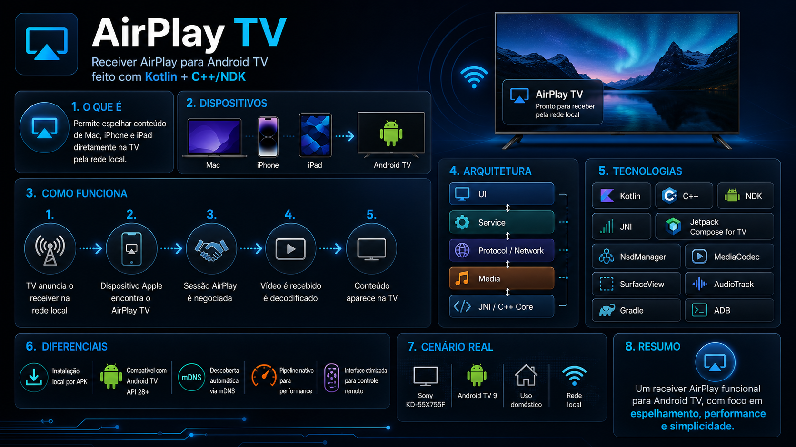

<div align="center">
  

# AirPlay TV

  **Receiver de AirPlay para Android TV com foco em espelhamento de tela, uso doméstico e boa performance em hardware legado.**<br>
  Construído com Kotlin, C++/NDK e APIs nativas do Android TV.

  [](#)
  [](#)
  [](#)

  <br/><br/>
  
</div>

---

## Sobre o projeto

O **AirPlay TV** é um aplicativo funcional que transforma uma TV com Android TV em um receiver compatível com AirPlay para **espelhamento de tela**, **vídeo** e **fluxos auxiliares de mídia**, com foco principal em uso local, instalação por APK e operação simples no dia a dia.

O projeto foi desenvolvido e validado prioritariamente para a **Sony KD-55X755F** com **Android TV 9 (API 28)**, mas a arquitetura foi construída para reutilizar componentes nativos do Android TV e manter boa compatibilidade com dispositivos equivalentes.

## Tags e palavras-chave

`airplay android tv`, `airplay for android tv`, `air play for android tv`, `android tv airplay receiver`, `android tv air play receiver`, `airplay receiver`, `air play receiver`, `screen mirroring receiver`, `iphone to android tv`, `mac to android tv`, `espelhamento iphone android tv`, `espelhamento mac android tv`, `apple airplay android tv`, `airplay app for tv`, `wireless display receiver`, `airplay mirroring`, `android tv mirroring`, `kotlin ndk airplay`

## O que o app entrega

- Receiver AirPlay para rede local.
- Descoberta automática via mDNS usando `NsdManager`.
- Sessão única por vez, com fluxo simples para uso doméstico.
- Pipeline nativo de protocolo e mídia com Kotlin + JNI + C++.
- Decodificação de vídeo com `MediaCodec` e renderização em `SurfaceView`.
- Interface otimizada para Android TV e controle remoto.
- Instalação local por APK, sem depender de Play Store.

## Como funciona

O app sobe um receiver AirPlay na rede local e anuncia a TV para dispositivos Apple. Quando um Mac, iPhone ou iPad seleciona o receiver, a aplicação negocia a sessão AirPlay, recebe os fluxos de mídia e envia cada parte para o pipeline apropriado no Android.

O fluxo principal é este:

1. O app abre na TV e registra o serviço `_airplay._tcp` na rede local.
2. O dispositivo Apple encontra o receiver na lista de AirPlay.
3. A camada nativa processa handshake, pairing e rotas do protocolo.
4. O vídeo espelhado chega ao pipeline de mirroring e é decodificado por `MediaCodec`.
5. O conteúdo é renderizado em tela cheia na TV.
6. A UI acompanha os estados da sessão e permite encerrar manualmente pelo controle remoto.

Além do espelhamento clássico, o projeto também possui rotas específicas para reprodução de foto/slideshow no ecossistema AirPlay.

## Arquitetura

O projeto segue uma arquitetura simples em camadas, sem DI framework, priorizando clareza e baixo overhead:

- `ui/`: telas, estados e interação com o controle remoto.
- `service/`: orquestração da sessão AirPlay e pipelines de mídia.
- `network/`: anúncio mDNS e utilitários de rede.
- `protocol/`: handshake, pairing, parsing e coordenação do protocolo AirPlay.
- `media/`: decodificação, filas, sincronização e telemetria.
- `cpp/`: core nativo, rotas RTSP/HTTP, FairPlay, sockets e integração com código adaptado de UxPlay.

Fluxo resumido:

`Android TV UI -> AirPlayService -> protocol/network/media -> JNI -> C++ native core -> MediaCodec / AudioTrack / SurfaceView`

## Tecnologias usadas

- `Kotlin`
- `C++ / NDK`
- `JNI`
- `Jetpack Compose for TV`
- `Android Leanback`
- `Coroutines`
- `NsdManager`
- `MediaCodec`
- `SurfaceView`
- `AudioTrack`
- `Bouncy Castle`
- `dd-plist`
- `Gradle`
- `ADB`

## Estados da aplicação

A interface trabalha com estados bem definidos:

- `Startup`: inicialização do app e do receiver.
- `Idle`: TV pronta para receber conexão AirPlay.
- `Connecting`: sessão em negociação com o cliente.
- `Mirroring`: espelhamento ativo em tela cheia.
- `MediaPlayback`: reprodução de foto ou slideshow.
- `Error`: falha tratada com retorno para estado seguro.

## Instalação na TV

### Pré-requisitos

- Android Studio ou ambiente Android com SDK configurado.
- `adb` disponível no terminal.
- NDK e CMake instalados para compilar a camada nativa.
- TV com Android TV `API 28+`.
- TV e dispositivo emissor na mesma rede local.
- Depuração ADB habilitada na TV.

### Instalação rápida via script

O repositório já inclui um script de deploy em [AirPlayTV/install-tv.sh](/Users/gabriel_fachini/Desktop/repos/airplay-tv-mvp/AirPlayTV/install-tv.sh).

```bash
cd AirPlayTV
./install-tv.sh 192.168.1.100:5555 --logs
```

O script:

1. compila o app em modo debug
2. conecta via ADB na TV
3. remove a instalação anterior
4. instala o APK novo
5. abre o app automaticamente
6. opcionalmente inicia o `logcat` filtrado

Se você informar apenas o IP, o script assume a porta `5555`.

### Instalação manual via ADB

```bash
cd AirPlayTV
./gradlew assembleDebug
adb connect 192.168.1.100:5555
adb install -r app/build/outputs/apk/debug/app-debug.apk
adb -s 192.168.1.100:5555 shell am start -n com.airplay.tv/.MainActivity
```

### Build de testes

```bash
cd AirPlayTV
./gradlew test
```

## Como usar

1. Abra o app na TV.
2. Aguarde a tela de pronto para conexão.
3. No Mac, iPhone ou iPad, abra a lista de AirPlay / Espelhamento de Tela.
4. Selecione o receiver anunciado pela TV.
5. Inicie o espelhamento.

Durante uma sessão ativa:

- `Back` encerra a sessão atual sem fechar o app.
- toque duplo em `OK/Enter` alterna a telemetria visual.
- toque longo em `OK/Enter` alterna o modo de apresentação do vídeo.

## Estrutura do repositório

```text
.
├── README.md
├── .specs/
│   ├── specs.md
│   ├── design.md
│   ├── task.md
│   └── memory.md
└── AirPlayTV/
    ├── app/
    │   ├── src/main/java/com/airplay/tv/
    │   │   ├── ui/
    │   │   ├── service/
    │   │   ├── protocol/
    │   │   ├── network/
    │   │   └── media/
    │   └── src/main/cpp/
    ├── gradlew
    └── install-tv.sh
```

## Hardware e alvo principal

- TV principal de desenvolvimento: `Sony KD-55X755F`
- Sistema alvo: `Android TV 9`
- `minSdk`: `28`
- `targetSdk`: `34`
- ABI: `armeabi-v7a` e `arm64-v8a`

## Decisões técnicas importantes

- mDNS com `NsdManager`, não `jmdns`
- vídeo com `MediaCodec` + `SurfaceView`, não `ExoPlayer`
- áudio com pipeline dedicado baseado em `MediaCodec` + `AudioTrack`
- bridge nativa com `JNI`
- sessão única por vez
- sem auto-reconnect
- foco em rede local confiável e uso doméstico

## Logs e depuração

Para acompanhar os logs do app:

```bash
adb logcat | grep "AirPlay"
```

Se estiver usando um device específico:

```bash
adb -s 192.168.1.100:5555 logcat | grep "AirPlay"
```

## Limitações e escopo atual

- O app é focado em **uso local/doméstico**, não em distribuição pública.
- O receiver trabalha com **uma sessão ativa por vez**.
- A aplicação precisa estar **aberta em primeiro plano** para anunciar e receber conexões.
- O projeto **não busca implementar AirPlay 2 completo**, multiroom ou um ecossistema Apple completo.
- Compatibilidade e ajustes finos podem variar conforme o dispositivo emissor e as características da rede Wi-Fi.

## Quando este projeto é útil

Este repositório é especialmente útil para quem procura:

- uma alternativa de **AirPlay para Android TV**
- um **receiver AirPlay open source**
- um app para **espelhar iPhone na Android TV**
- um app para **espelhar Mac na Android TV**
- um estudo prático de **Kotlin + NDK + JNI + MediaCodec**
- um projeto real de **screen mirroring receiver**

## Troubleshooting básico

### A TV não aparece na lista de AirPlay

- confirme que a TV e o dispositivo Apple estão na mesma rede
- confirme que o app está aberto na TV
- confira se a TV está com acesso de rede ativo
- verifique os logs de mDNS no `logcat`

### O `adb connect` falha

- confira se a depuração ADB por rede está habilitada
- valide IP e porta da TV
- teste a conectividade da rede local

### O app instala, mas não abre corretamente

- abra os logs com `adb logcat | grep "AirPlay"`
- reinstale o APK com `adb install -r`
- execute novamente o `am start`

## Roadmap de evolução

O app já é utilizável, mas segue aberto para refinamentos em áreas como:

- robustez de compatibilidade entre emissores Apple
- evolução do pipeline de áudio e sincronização A/V
- melhoria de tratamento de erros e observabilidade
- polimento de UX para cenários longos de uso

## Referências rápidas do projeto

- requisitos: [.specs/specs.md](/Users/gabriel_fachini/Desktop/repos/airplay-tv-mvp/.specs/specs.md)
- design técnico: [.specs/design.md](/Users/gabriel_fachini/Desktop/repos/airplay-tv-mvp/.specs/design.md)
- memória técnica do projeto: [.specs/memory.md](/Users/gabriel_fachini/Desktop/repos/airplay-tv-mvp/.specs/memory.md)
- app Android: [AirPlayTV](/Users/gabriel_fachini/Desktop/repos/airplay-tv-mvp/AirPlayTV)

---

<p align="center"><b>AirPlay TV</b><br/>AirPlay receiver for Android TV, air play for Android TV, screen mirroring receiver, iPhone to Android TV, Mac to Android TV.</p>
